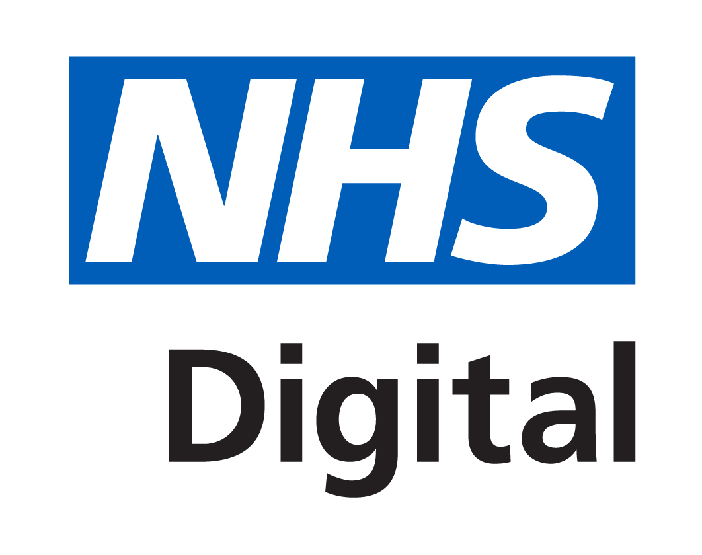
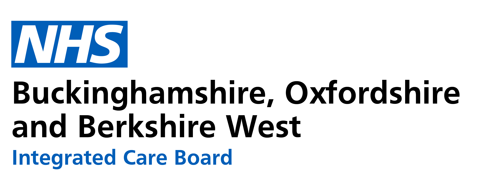
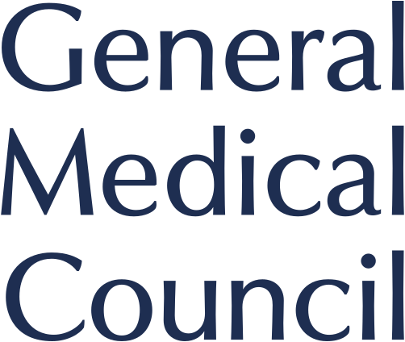

## Dr Imran Khan
Clinical Informatics Lead and NHS GP  
On GP Speciast Register  
[Email](mailto:hello@workwithcarolyn.com) / [Website](https://workwithcarolyn.com/) / [LinkedIn](https://www.linkedin.com/in/carolstran/) / [GitHub](https://github.com/carolstran/) / [Twitter](https://twitter.com/carolstran/) / [DEV](https://dev.to/carolstran/)

##  Experience
 
**IGARD Specialist Member** [NHS Digital](https://digital.nhs.uk/about-nhs-digital/corporate-information-and-documents/independent-group-advising-on-the-release-of-data/) _(Dec 2020 - Present)_ 
Act as an independent specialist member considering requests for access/dissemination of NHS data and also advising on other areas of data protection and assurance for release of data by NHS Digital.
  

 
**Clinical Digital Place Lead** [BOB ICS](https://www.bucksoxonberksw.icb.nhs.uk/) _(March 2022 - Present)_ 
Provide clinical oversight and advice to Berkshire west regarding GPIT issues in primary care.
- Support the development of clinical safety assurance for digital projects introduced across the place and in alignment with the system.
- Provide clinical advice to new projects and adoption of digital solutions in primary care across the place and the system.
- Look at budgets and effetive use of GPIT futures funding.
  

 
**Health Informatics Group Deputy Chair and Joint GPIT Committee Deputy chair** [RCGP](https://www.rcgp.org.uk/) _(Jan 2022 - Present)_  
As deputy Chair of the Health informatics group I represent the RCGP various aspects of Health Informatics related to:
- Providing a co-ordinated joint approach to general practice stakeholder representation in information management and communications technology projects within the NHS (jointly with the BMA).
- To consider the development of information management and technology in NHS general practice across the UK
- To consider training and change management issues in the provision of quality information within primary care and its interface with the rest of the health service
- To offer support and guidance to general practice on IM&T , Information Gevernance, data proteciion and general clinical informatics 

 
**GMC Associate**  _(Jan 2020 - Present)_  
Professional and Linguistic Assessments Board examiner.

## 👩🏼‍🎓 Education

**12-week intensive coding course** focused on full-stack JavaScript 
[SPICED Academy](https://www.spiced-academy.com/) - Berlin, Germany _(Apr 2017 - Jun 2017)_  

**Bachelor of Arts** in Journalism and Media Studies 
[Beloit College](https://www.beloit.edu/) - Beloit, Wisconsin, USA _(2011 - 2015)_

**Washington Semester Program** for Journalism and New Media 
[American University](https://www.american.edu/) - Washington DC, USA _(Fall 2014)_

**International Exchange** studying Political Science 
[Yeditepe Üniversitesi](https://yeditepe.edu.tr/en) - Istanbul, Turkey _(Spring 2013)_
